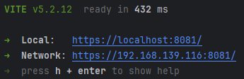
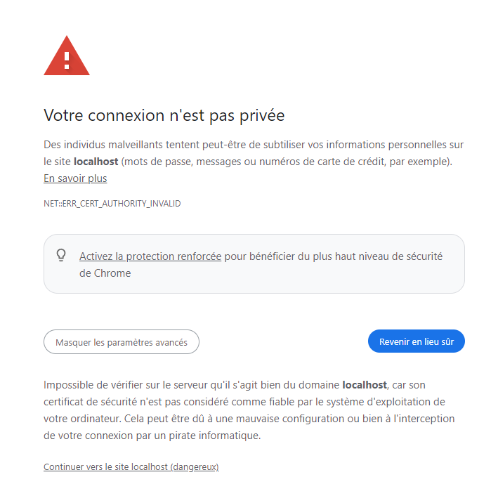
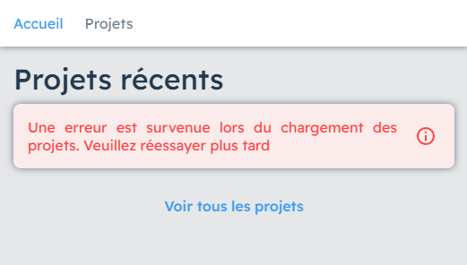
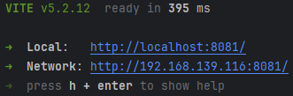

# HERA


## Introduction

Ce fichier a pour but de vous aider à configurer et démarrer le projet pour le développement.

Ce dépot contient tous les fichiers requis pour créer scènes 3D et les afficher en réalité augmentée.
Il est composé d'un outil d'édition 3D permettant de créer des projets AR, et d'un visualiseur permettant d'afficher ces projets en réalité augmentée.
Enfin, l'éditeur et l'outil de visualisation accèdent à une base de données commune, par le bias d'un API.


### <ins>Structure du projet</ins>

Le projet contient 3 composants principaux :
- Deux sites web
  - **Un site d'édition** (administrateur), permettant de créer ses propres projets de réalité augmentée. Le port par défaut est `8080`
  - **Un site de visualisation** (utilisateur), permettant de visualiser les projets créés depuis l'éditeur. Le port par défaut est `8081`
- Un **API**, permettant de relier les deux sites précédents à une base de données commune. Le port par défaut est `3000`


Les fichiers sont organisés selon la structure suivante :
```
project/
│
├─ backend/
│  ├─ api/
│
├─ frontend/
│  ├─ admin/
│  ├─ user/
```
- `/backend/api/` contient le code nécessaire au fonctionnement de l'API
- `/frontend/admin/` contient le code nécessaire au fonctionnement de l'éditeur de projets AR
- `/frontend/user/` contient le code nécessaire au fonctionnement du site de visualisation des projets AR


### <ins>Technologies</ins>
Les technologies suivantes ont été utilisées lors du développement :
- [Three.js](https://threejs.org/)
- [WebXR](https://immersiveweb.dev/)
- [Vue.js](https://vuejs.org/)
- [Express.js](https://expressjs.com/)
- [Sequelize](https://sequelize.org/)


<br>

## Installation

### <ins>Prérequis</ins>
Pour installer et utiliser le projet, vous aurez besoin de :
- Un IDE adapté pour le développement web (Recommandé : [WebStorm](https://www.jetbrains.com/webstorm/))
- [Node.js](https://nodejs.org/) installé sur votre ordinateur
- Un smartphone/tablette Android :
  - compatible ARCore ([liste des appareils comatibles](https://developers.google.com/ar/devices))
  - avec Google Chrome installé (WebXR ne fonctionne que dans Chrome). 
- [ADB](https://developer.android.com/tools/adb) (Optionnel)


### <ins>Instructions</ins>
1. Si ce n'est pas déjà fait, clonnez ce dépôt avec la commande `git clone`
2. Basculez sur la branche `dev` :
    ```shell
    git checkout dev
    ```

#### Installation du site de visualisation
1. Accédez au dossier `frontend/user` :
    ```shell
    cd frontend/user
    ```

2. A présent, vous devriez vous trouver dans un dossier contenant tous les fichiers requis pour faire fonctionner le site de visualisation en AR.
   Ce dossier contient nottament `package.json`, qui contient la liste des dépendances requises. Lancez l'installation de ces dépendances :
     ```shell
     npm install
     ```
    <ins>**Remarque**</ins> : `npm` doit être installé sur votre ordinateur. Si la commande ne fonctionne pas, vérifiez votre [installation de Node.js](#prérequis)

3. Une fois l'installation terminée, démarrez le serveur et testez votre projet :
    ```shell
     npm run dev
     ```
   Un serveur web https sera lancé sur le port `8081`. Vérifiez la présence de ce message dans la console :\
   

4. Tester votre projet en accédant à la page https://localhost:8081.\
Si tout s'est bien passé, la page d'accueil du site devrait s'afficher <ins>en indiquant une erreur</ins>. C'est tout à fait normal, la page tente de récupérer les données depuis l'API, que nous n'avons pas encore configuré.\
<ins>**Remarque**</ins> : en fonction du navigateur utilisé, vous devrez peut être accepter les risques de sécurité. [Détails](#contourner-les-restrictions-de-sécurité-pour-le-développement)


#### Installation de l'API
1. Depuis la racine du projet, accédez au dossier `backend/api` :
    ```shell
    cd backend/api
    ```
2. Comme pour l'installation du site, vérifier la présence du fichier `package.json`, et lancez l'installation des dépendances :
    ```shell
    npm install
    ```
   
3. Démarrez le serveur :
    ```shell
   npm run start
   ```
   L'API est maintenant joignable sur le port `3000` : https://localhost:3000 \
   <ins>**Remarque**</ins> : Le premier lancement peut prendre plus de temps, et vous devrez accepter la création d'un certificat auto-signé.

4. Accédez à https://localhost:3000/api/dev/hello, et assurez vous qu'aucune erreur n'est affichée.


Le projet devrait maintenant être fonctionnel. Retournez sur le site et actualisez la page.
Le message d'erreur devrait disparaitre, et la page d'accueil devrait afficher les projets par défaut contenus dans la base de données.
Choisissez-en un, puis essayer de l'afficher en réalité augmentée [depuis votre smartphone](#tester-depuis-un-smartphone-android) (ou autre appareil compatible).


#### Installation de l'éditeur
Répétez les étapes réalisées précédement pour le site "utilisateur" (rappel ci dessous):
1. Accédez au dossier `frontend/admin` :
    ```shell
    cd frontend/user
    ```

2. Lancez l'installation de ces dépendances :
     ```shell
     npm install
     ```

3. Démarrez le serveur et testez votre projet :
    ```shell
     npm run dev
     ```
   Un serveur web https sera lancé sur le port `8080`.

4. Tester votre projet en accédant à la page https://localhost:8080. \
Une page de connexion s'affiche. Pour vous connecter, utiliser le compte par défaut :
   - email : `admin@gmail.com`
   - mot de passe : `admin`


<br>

## Configuration avancée

<ins>**Remarque :**</ins> toutes les opérations présentées dans la section "Configuration avancée" sont facultatives

### <ins>Configuration de la base de données / API</ins>
#### Réinitialisation des données
L'API est configuré de manière à réinitialiser la base de données à chaque démarrage (à chaque fois que la commande `npm run start` est exécutée).
Il est possible de désactiver ce comportement en modifiant le fichier `backend/api/app.js`. Voici un extrait de sont contenu :

```js
...
async function main () {
    await initializeDatabase(true);     //forcer la création des tables
    await resetDatabase();              //vider le contenu de toutes les tables
    await insertDefaults();             //insérer les valeurs par défaut

    app.use(project);
    ...
```
3 fonctions sont intéressantes ici :
- `initializeDatabase(force)` permet de créer les tables nécessaires
  - si `force` vaut `true`, toutes les tables seront supprimées, puis recrées
  - si `force` vaut `false`, seules les tables qui n'existent pas déjà seront crées
- `resetDatabase()` permet de supprimer le contenu de toutes les tables (mais sans supprimer les tables, seulement le contenu)
- `insertDefaults()` permet d'insérer des valeurs par défaut dans les tables, à titre de démonstration.


#### Accès à la base de données
Les données contenues dans la base de données sont accédées par le bias de l'ORM Sequelize.
Par défaut, une base de données temporaire SQLite est créée en mémoire.
Vous pouvez personnaliser ce comportement en modifiant le fichier `backend/api/src/orm/database.js`.\
Référez-vous à la [documentation officielle](https://sequelize.org/docs/v6/other-topics/dialect-specific-things/) de Sequelize pour vous aider dans la configuration d'un autre type de base de données.

#### Modification des données par défaut
L'insertion des données par défaut est effectuée directement depuis le code javascript.
Toutes les insertions sont effectuée depuis un fichier dédié : `backend/api/src/orm/defaults/insertDefaults.js`. Voici un extrait de ce fichier :
```js
export async function insertDefaults() {
    const userAdmin = ArUser.create({   //insertion dans la table ArUser
        id: 'abc-123',
        username: 'myUsername',
        email: 'user@email.com',
        password: 'myPassword',
    });
    ...
}
```
Ce fichier contient la fonction `insertDefaults()`.
Le corps de la fonction peut être modifié pour insérer vos propres valeurs.
Chaque appel de la fonction `create()` (de Sequelize) correspond à l'insertion d'une ligne dans la table choisie.\
[Documentation pour la création d'entités](https://sequelize.org/docs/v6/core-concepts/model-instances/#creating-an-instance)

<ins>**Remarque**</ins> : Assurez-vous d'insérer au moins un utilisateur.
Son e-mail et son mot de passe seront requis pour accéder à l'éditeur.
Les valeurs par défaut sont : e-mail : `admin@gmail.com`, mot de passe : `admin`.

#### Modification du port
Par défaut, l'API est joignable sur le port `3000`.
Il est possible de modifier cette valeur pour démarrer sur le port de votre choix.
Voici un extrait du fichier `backend/api/app.js` :
```js
https.createServer(options, app).listen(process.env.PORT || 3000, () => {
    console.log('Server started on port 3000')
})
```
Remplacez `3000` par la valeur de votre choix, puis redémarrez l'API (`npm run start`).

<ins>**Remarque :**</ins> Après avoir modifié le port, les sites d'édition et de visualisation tenteront toujours de faire des requêtes sur le port `3000`, entrainant une erreur 404.
Vous devez modifier leur adresse de destination dans les fichiers `frontend/user/src/js/endpoints.js` et `frontend/admin/src/js/endpoints.js` :
```js
export const ENDPOINT = `${HOST}:3000/api/` //le site tente toujours d'effectuer des requêtes sur le port 3000;
```
Remplacer `3000` de manière à utiliser la valeur choisie précédement.


### <ins>Modifications du serveur web</ins>

[//]: # (<ins>**Remarque :**</ins> Les opérations présentées dans cette partie sont présentées sur le site de visualisation, mais les étapes peuvent être reproduites avec le site d'édition.)

#### Configuration du serveur de fichier
Pour des raisons de simplicité, les ressources telles que les modèles 3D et les images sont stockées directement sur le serveur web, dans le dossier `frontend/user/public/`
Si vous souhaitez utiliser un serveur de fichier personnalisé, vous devrez modifier les fichiers `frontend/user/src/js/endpoints.js` et `frontend/admin/src/js/endpoints.js` :
```js
const RESOURCES_SERVER = `${HOST}:8081/public`; //par défaut, les ressources sont récupérée depuis https://localhost:8081, ce qui correspond au port par défaut du site de visualisation
```
Vous pouvez changer l'URL pour modifier l'emplacement depuis lequel les fichiers sont chargés.


#### Modification des ports
Le serveur Vite est lancé par défaut sur les port `8080` et `8081` pour les sites d'édition et de visualisation.
Il est possible de changer ces valeur, en modifiant les fichier `package.json` pour chacun des deux sites.
Voici un extrait :
``` js
  ...
  "scripts": {
    "dev": "vite --host --port 8080", //modifiez le port ici
    "build": "vite build",
    ...
```
Le port peut être changé en modifiant  l'option `--port ` du script `dev`.
Assurez-vous d'utiliser un port libre, et de ne pas utiliser le même port pour les deux sites.

<ins>**Remarque :**</ins> Si vous décidez de modifer le port du site du visualisation, vous devrez [modifer le chemin d'accès aux ressources](#configuration-du-serveur-de-fichier) pour l'éditeur, qui récuprère les ressources sur le port `8081` par défaut.


<br>

## Aide et conseils pour le développement


### <ins>Démarrage d'une session WebXR</ins>
WebXR est la technologie utilisée pour la réalité augmentée.
Elle permet notamment d'accéder à la caméra et de tracker ses mouvements.
Cette technologies fonctionne sous certaines conditions :
- Le navigateur utilisé est Google Chrome
- L'appareil est compatible avec la réalité augmentée
- Le site utilise une connexion sécurisée (`https`)

<ins>**Remarque :**</ins> l'adresse `localhost` est la seule exception, qui peut fonctionner en mode `http`. Exemples :
```shell
http://localhost:8081 # WebXR peut fonctionner ✔
https://localhost:8081 # WebXR peut fonctionner ✔

https://192.168.1.32:8081 # WebXR peut fonctionner ✔
http://192.168.1.32:8081 # WebXR ne peut pas fonctionner ❌

https://my-website.com # WebXR peut fonctionner ✔
http://my-website.com # WebXR ne peut pas fonctionner ❌
```


### <ins>Contourner les restrictions de sécurité pour le développement</ins>
Le démarrage d'un session WebXR requiert une connexion sécurisé (`https`).
Le projet inclut donc un plugin permettant de démarrer le serveur Vite en mode `https` en utilisant un certificat auto-signé.
Ce plugin est à utiliser pour le développement uniquement, et doit être retiré lors de la mise en production.\
Par défaut, les navigateurs ne font pas confiance aux certificats auto-signés, et bloquent l'accès au site.
Vous pouvez résoudre ce problème en essayant une des deux méthodes ci-dessous :

#### Accepter les risques de sécurité
\
Vous devriez voir ce message si vous tentez d'accéder au site pour la première fois.
Pour continuer, il suffit de cliquer sur "Continuer vers le site" (après avoir développé la section "Paramètres avancés")\
Cependant, le site devrait continuer d'afficher une erreur, même après avoir accepté le risque :
\
Cela est dû au fait que le navigateur tente de récupérer les données depuis l'API, qui n'est pas considéré comme une ressource sécurisée.
La seule solution pour résoudre ce problème est d'effectuer manuellement une requête à l'API, et cliquer sur "Continuer vers le site" (comme à l'étape précédente)\
[Cliquez ici pour effectuer une requête sur le port par défaut](https://localhost:3000/api/dev/hello)\
Après cette étape, retournez sur le site et actualisez la page. Le problème devrait être résolu.

#### Désactiver le plugin https
Cette méthode consiste à retirer le plugin `vite-plugin-mkcert` pour démarrer le serveur en mode normal (`http`).
Cela permet de supprimier les avertissements de sécurité, mais il ne sera plus possible de démarrer une session WebXR (sauf en local, [Détails ici](#démarrage-dune-session-webxr)).
Des modifications sont nécessaires au niveau du code des deux sites, et de l'API :

- Pour les deux sites web :
  - Accédez aux fichiers `frontend/user/vite.config.js` et `frontend/admin/vite.config.js`.
  Voici un extrait de leur contenu :
    ```js
    import { fileURLToPath, URL } from 'node:url'
    import { defineConfig } from 'vite'
    import vue from '@vitejs/plugin-vue'
    import mkcert from "vite-plugin-mkcert";    //supprimez cette ligne
    
    // https://vitejs.dev/config/
    export default defineConfig({
        plugins: [
            vue(),
            mkcert(),       //supprimez cette ligne
        ],
        ...
    })
    ```
  - Ici, deux lignes concernent le plugin `mkcert`. Supprimez (ou commentez) ces lignes, puis redémarrez le serveur (`npm run dev`).
  Vérifiez le message dans la console :\
  \
  Le serveur est bien lancé en mode `http`. Répétez les étapes précédentes pour le deuxième site.
  - Pour désinstaller complètement le plugin (facultatif) :
    ```shell
    npm uninstall vite-plugin-mkcert
    ```
    
- Pour l'API :\
  Contrairement aux deux sites web, l'API n'est pas démarré en utilisant le serveur Vite.
  Le plugin n'est donc pas disponnible, et les étapges sont différentes :
  - Accédez au fichier `backend/api/app.js`. Voici un extrait de sont contenu :
    ```js
    ...
    import cors from 'cors'
    
    //for https only :                                //
    import * as fs from "node:fs";                    //
    import * as https from "node:https";              //
    const options = {                                 // Supprimez ces lignes
        key: fs.readFileSync('privatekey.key'),       //
        cert: fs.readFileSync('certificate.crt')      //
    };                                                //
  
    ...
    
    async function main () {
        ...
        https.createServer(options, app).listen(process.env.PORT || 3000, () => {   //modifiez cette ligne
            console.log('Server started on port 3000')
        })
    }
    ```
  - Deux modifications importantes sont à effectuer :
    1. Supprimez les lignes indiquées par le commentaire concernant `https`.
    2. Modifiez la fonction `main()` : remplacez `https.createServer(options, app)` par `app`, pour obtenir le résultat suivant :
       ```js
       app.listen(process.env.PORT || 3000, () => {
           console.log('Server started on port 3000')
       })
       ```
  - Redémarrez l'API (`npm run start`), et testez une requête en `http`, par exemple http://localhost:3000/api/dev/hello

  <ins>**Remarque :**</ins> Après avoir modifié le mode `http`, les sites d'édition et de visualisation tenteront toujours de faire des requêtes à l'API en mode `https`, entrainant une erreur.
  Vous devez modifier leur adresse de destination dans les fichiers `frontend/user/src/js/endpoints.js` et `frontend/admin/src/js/endpoints.js` :
  ```js
  const HOST = 'https://localhost'; //le site tente toujours d'effectuer des requêtes en mode https;
  ```
  Modifiez la valeur de `HOST` de manière à obtenir une adresse en `http`, par exemple `http://localhost`

Si vous ne parvenez toujours pas à faire fonctionner le site après avoir appliqué une des 2 méthodes ci-dessus, essayer depuis un autre navigateur.
Notez cependant qu'il est nécessaire d'utiliser Chrome pour lancer la réalité augmentée, les autres navigateurs seront affichés comme incompatibles. 


### <ins>Tester depuis un smartphone Android</ins>
Pour tester vous projets en réalité augmentée, vous aurrez besoin d'accéder au site de visualisation depuis un smartphone Android (ou autre appareil compatbile).
Deux méthodes sont possibles :

#### Accès distant
Dans ce projet, Vite est configuré de manière à lancer un serveur accessible sur le réseau (grâce à l'option `--host`).
Vous pouvez vous en apercevoir en regardant le message affiché dans la console au moment du lancement :\
\
Ici, le serveur est accessible depuis un navigateur, par deux adresse possibles :
- `https://localhost:8081`
- `https://192.168.139.116:8081` (l'IP peut être différente)

Dans ce cas, assurez vous que le téléphone Android est connecté au même réseau Wi-Fi que le PC sur lequel le serveur à été lancé,
puis accédez simplement au site en rentrant son URL distant (celui avec l'IP) dans un navigateur (depuis le téléphone).

Le site devrait apparaître en affichant une erreur de chargement.
Cela est dû au fait qu'il tente de récupérer les données de l'API à l'adresse `https://localhost`, qui n'est pas joignable depuis le téléphone.
Vous devez donc modifier les fichiers `frontend/user/src/js/endpoints.js` et `frontend/admin/src/js/endpoints.js`, de manière à changer la valeur de `HOST` pour y inclure l'IP du PC, par exemple :
```js
const HOST = 'https://192.168.139.116';     //utilisez l'IP du PC serveur
```


#### Accès local
Cette méthode consiste à exposer les ports locaux du PC pour les rendre accessible aux appareils Android connectés par câble.
Cette méthode est recommandée pour le développement et les sessions de debug. Elle prend plus de temps à mettre en place, mais offre plusieurs avantages :
- Vous n'avez pas besoin d'utiliser une connexion `https`
- Vous pourrez accéder à la console javascript du téléphone

Cependant, le téléphone doit rester branché en permanence pour conserver la connexion.

- Assurez vous d'avoir installé ADB sur votre ordinateur, et activé le débogage USB sur votre téléphone ([Tutoriel ici](https://www.xda-developers.com/install-adb-windows-macos-linux/)).
- Branchez votre téléphone au PC.
- Dans un terminal, entrez la commande `adb devices`, et assurez vous que votre téléphone apparait dans la liste (voir tutoriel)
- Entrez la commande suivante :
  ```shell
  adb reverse tcp:8081 tcp:8081
  ```
  Cette commande permet d'exposer le port local `8081` du PC au travers du port `8081` du téléphone.
  Recommencez avec les ports `8080` et `3000` (ou les autres ports que vous avez utilisé).
- Sur le téléphone, accédez à l'adresse https://localhost:8081 depuis un navigateur. Le site devrait fonctionner.


Après avoir appliqué une des deux méthodes précédentes, vous serez en mesure de tester la réalité augmentée sur votre téléphone Android, à condition d'utiliser le navigateur Google Chrome.


### Autres conseils et remarques

#### Accéder à la console javascript du téléphone
Lors du développement, vous aurrez besoin régulièrement de vérifier les erreur causée par la réalité aumentée directement dans la console javascript du téléphone.
Il est possible d'y accéder à condition d'utiliser Google Chrome sur le PC et sur le téléphone :
- Assurez vous d'avoir suivi [ces instructions](#accès-local) (votre téléphone doit être branché au PC...)
- Depuis le PC accédez à [chrome://inspect/#devices](chrome://inspect/#devices) (depuis le navigateur Chrome)
- Au bout de quelques secondes, la liste des onglets ouverts sur le téphone devrait apparaitre.
  Cherchez l'onglet qui vous intéresse, puis cliquez sur 'inspect' 
- Une nouvelle fenêtre s'ouvre, depuis laquelle vous pouvez interragir avec le site, et accéder à la console.


#### Résoudre les problèmes de performances
Le serveur Vite utilise un système de "hot reload", qui recharge automatiquement la page dès que le code source est changé.
Ce système est pratique pour le développement, mais peut causer des problèmes de performances, puisque les modèles 3D utilisés sont également rechargés, sans libérer la mémoire utilisée par les précédents.
Si vous rencontrez des problèmes de performance, pensez à recharger manuellement la page pour vider la mémoire.


#### Corriger les erreurs de chargements

Si vous ne parvenez pas à charger le site web, ou si celui-ci affiche une erreur, vérifiez les messages dans la console.\
Une erreur courrante est `ERR_CERT_AUTHORITY_INVALID`, qui indique que le navigateur tente d'accéder à une ressource considérée comme non fiable. Suivez [ces instructions](#accepter-les-risques-de-sécurité) pour corriger le problème.\

Pensez également à vérifier le contenu des fichiers `frontend/user/src/js/endpoints.js` et `frontend/admin/src/js/endpoints.js`, qui contient notamment les adresses réseau utilisées pour communiquer avec l'API.
Les erreurs de chargement sont généralement causée par une mauvaise configuration de ce fichier.
