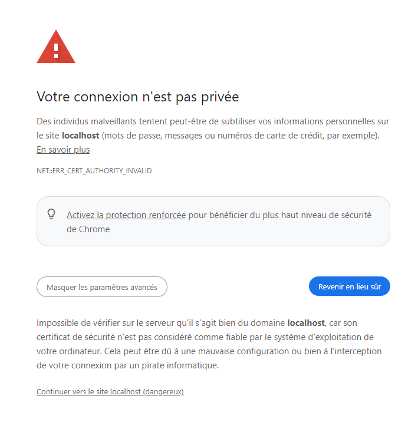
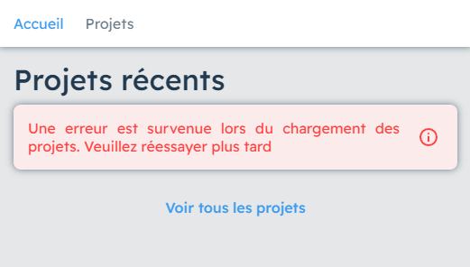

# HERA

HERA is a no-code AR authoring platform for cultural heritage. It is entirely web-based and does not need any coding abilities. For more informations, check [the paper](https://hal.science/hal-04725966v1) and the [demo video](https://www.youtube.com/watch?v=ZqwUtapg_Bk). 

It allows users to create, edit, and visualize augmented reality scenes directly in the browser. The project is split into a backend API and two frontend applications: an admin/editor interface and a user/viewer interface.

## Project Structure & Default Development Ports

| Folder           | Role                                                  | URL                              |
| `backend/api`    | Express API, database, authentication, uploaded files | `https://localhost:8080`         |
| `frontend/user`  | Viewer used to open and visualize AR projects         | `https://localhost:8081/viewer/` |
| `frontend/admin` | Editor used to create and manage projects             | `https://localhost:8082/editor/` |

The viewer and editor need the API to be running.

## Requirements

Before running the project, make sure you have:

- Node.js and npm installed
- a browser compatible with WebXR for AR testing (Google Chrome)
- local HTTPS certificates for development
- a working local database configuration
- An Android smartphone/tablet ARCore compatible ([list of compatible devices](https://developers.google.com/ar/devices)) to test AR.
- [ADB](https://developer.android.com/tools/adb) (Optional if you need to open the console on the phone/tablet) 


## Installation
1. If you haven't already, clone this repository with the `git clone` command
2. Switch to the `dev` branch:
```shell
git checkout dev
```
3. Install dependencies in each folder and run locally:

```bash
cd backend/api
npm install
npm run start

cd frontend/user
npm install
npm run dev

cd ../admin
npm install
npm run dev

```
Open:

- API test: `https://localhost:8080/api/dev/hello`
- Viewer: `https://localhost:8081/viewer/`
- Editor: `https://localhost:8082/editor/`

## HTTPS and Certificates

WebXR requires a secure context. In practice, AR features need HTTPS, except on `localhost`.

During local development, HERA uses local or self-signed certificates. Your browser may show a security warning the first time you open the API, viewer, or editor.

Open these URLs once and accept the warning:

- `https://localhost:8080/api/dev/hello`
- `https://localhost:8081/viewer/`
- `https://localhost:8082/editor/`

If the certificate is not accepted, the frontend may load, but API requests, assets, or AR features may fail.

## Testing on a Phone or Tablet

`localhost` on a phone means the phone itself, not your computer.

To test HERA from a phone or tablet, both devices must be connected to the same network.

Find your computer IP address. On Windows:

```powershell
ipconfig
```

Look for the IPv4 address of your Wi-Fi adapter, for example:

```text
192.168.1.42
```

Then open the app from the phone using the computer IP:

```text
https://192.168.1.42:8081/viewer/
```

For the admin/editor:

```text
https://192.168.1.42:8082/editor/
```

You may also need to open and accept the API certificate on the phone:

```text
https://192.168.1.42:8080/api/dev/hello
```

If the phone cannot load the project, check that:

- the phone and computer are on the same Wi-Fi network;
- the API is running;
- the viewer/editor is running with HTTPS;
- the browser accepted the certificate;
- the firewall allows ports `8080`, `8081`, and `8082`;
- the frontend points to the correct API address.

## Android ADB Option

If testing with an Android device connected by USB, you can use ADB reverse.

Viewer:

```bash
cd frontend/user
npm run adb
```

Admin/editor:

```bash
cd frontend/admin
npm run adb
```
This can make local ports accessible from the Android device while debugging.

## Environment Variables

HERA uses several values that depend on the local machine or deployment environment:

- backend port
- JWT secret
- CORS origin
- HTTPS certificate paths
- frontend API target

These values should be configured through `.env` files instead of being hardcoded in the source code.

Before:

```text
Changing machine = modifying the source code
```

After:

```text
Changing machine = modifying the .env file
```

### Backend `.env`

Create a `.env` file inside:

```bash
backend/api/.env
```

Example:

```env
NODE_ENV=development
PORT=8080
JWT_SECRET=dev-only-insecure-secret-change-me
CORS_ORIGIN=*
HTTPS_KEY_PATH=../../certs/dev-key.pem
HTTPS_CERT_PATH=../../certs/dev.pem
```

For production, `JWT_SECRET` must be replaced with a long random private value.

Generate a random secret with:

```bash
node -e "console.log(require('crypto').randomBytes(64).toString('hex'))"
```

Real `.env` files must not be committed to the repository. Only example files such as `.env.example` should be shared.

Example `.env.example`:

```env
NODE_ENV=development
PORT=8080
JWT_SECRET=replace-with-a-long-random-secret
CORS_ORIGIN=*
HTTPS_KEY_PATH=../../certs/dev-key.pem
HTTPS_CERT_PATH=../../certs/dev.pem
```

### Frontend `.env`

The frontend should not contain hardcoded local IP addresses such as:

```js
const API_TARGET = "https://10.42.205.102:8080";
```

Use an environment variable instead.

Example for local development:

```env
VITE_API_TARGET=https://localhost:8080
```

Example for phone testing:

```env
VITE_API_TARGET=https://192.168.1.42:8080
```

After changing a frontend `.env` file, restart the Vite dev server.

## Changing Ports

Default ports are:

- API: `8080`
- Viewer: `8081`
- Admin/editor: `8082`

To change the viewer port, edit `frontend/user/package.json`:

```json
"dev": "vite --host --port 8081"
```

To change the admin/editor port, edit `frontend/admin/package.json`:

```json
"dev": "vite --host --port 8082"
```

To change the API port, update the backend port and make sure the frontends still point to the same API port.

If a Vite proxy is used in development, update the proxy target too.

## Common Issues

### The viewer says it cannot load projects

Make sure the API is running:

```text
https://localhost:8080/api/dev/hello
```

If testing from a phone or tablet, use the computer IP instead of `localhost`:

```text
https://192.168.1.42:8080/api/dev/hello
```

Also check that the frontend points to the correct API URL.

### The AR button does not work

Check that the page is opened with HTTPS and that the device/browser supports WebXR.

WebXR generally requires:

- HTTPS;
- a compatible browser;
- a compatible device;
- permissions for camera and motion sensors when required.

### Assets do not load

Open the API URL in the browser and accept the certificate warning.

Also check that:

- the API is running;
- uploaded files exist in the expected public folder;
- `/public` files are reachable from the device;
- the browser accepted the HTTPS certificate;
- the frontend is using the correct API host and port.

### Login stops working after changing `JWT_SECRET`

This is expected.

Existing tokens were signed with the old secret. After changing `JWT_SECRET`, old tokens become invalid.

Log out, clear the browser storage if needed, and log in again.

### The backend cannot find HTTPS certificates

Check the values in `.env`:

```env
HTTPS_KEY_PATH=../../certs/dev-key.pem
HTTPS_CERT_PATH=../../certs/dev.pem
```
Make sure the files exist and that the paths are correct relative to the backend runtime file.

If the paths are wrong, the backend may fail at startup with a file-not-found error.

### The phone cannot access the viewer or editor

Check that:
- the phone and computer are on the same Wi-Fi
- the frontend was started with `--host`
- the firewall allows ports `8080`, `8081`, and `8082`
- the URL uses the computer IP, not `localhost`
- the phone browser accepted the API certificate

Correct example:
```text
https://192.168.1.42:8081/viewer/
```

Wrong from a phone:
```text
https://localhost:8081/viewer/
```

### Project import or database data is broken
If project import fails or the default data is missing recreate the local database once.
1- Open:

```bash
backend/api/app.js
```

2- Temporarily change the database initialization to:

```js
await initializeDatabase({ force: true });
```

3- Then uncomment:

```js
await resetDatabase();
await insertDefaults();
```

4- Restart the backend once. This forces the recreation of the tables and reinserts the default data.

5- After the reset works, immediately restore:

```js
await initializeDatabase({ force: false });
```

6- Then comment again:

```js
// await resetDatabase();
// await insertDefaults();
```

This avoids resetting the database at every server restart.

> Do not keep `force: true` enabled permanently. Do not use this procedure in production.

### API target still points to an old IP address

If the frontend still calls an old local IP address, check the Vite configuration and frontend `.env` files.

Example:

```env
VITE_API_TARGET=https://localhost:8080
```

For phone testing:

```env
VITE_API_TARGET=https://192.168.1.42:8080
```

Restart the frontend dev server after changing `.env`.

#### Accepting the certificates
\
You should see this message if you are trying to access the site for the first time.
To continue, simply click "Continue to site" (after expanding the "Advanced settings" section)\
However, the site should still display an error even after accepting the risk:
\
This is because the browser is trying to fetch data from the API, which is not considered a secure resource.
The only solution to solve this problem is to manually make a request to the API, and click on "Continue to the site" (as in the previous step)\
[Click here to make a request on the default port](https://localhost:3000/api/dev/hello)\
After this step, go back to the site and refresh the page. The problem should be solved.

## Production Notes

For production deployment:

- use a private and long `JWT_SECRET`
- never commit the real `.env` file
- avoid `CORS_ORIGIN=*`
- use real HTTPS certificates
- configure API routing with a production reverse proxy
- do not use `force: true` for database initialization
- do not run local database reset helpers automatically
- make sure admin routes are protected server-side, not only in the frontend

