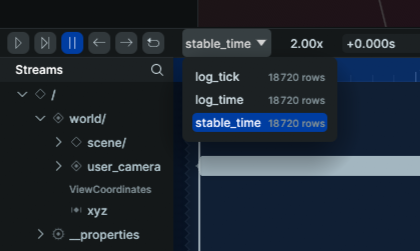
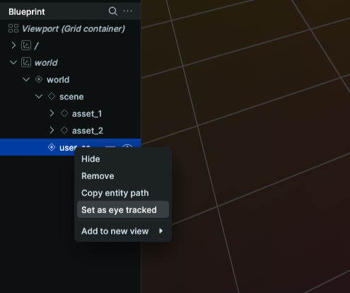

# RERUN - User Data Tracking Replay

## Introduction

The goal of this file is to help you configure and use the user data tracking replay script.

The /tools/rerun file contains the unique script needed to replay what a user did during a presentation with recorded data from databaseRecords.

## Installation

### Prerequisites

To use this tool, you will need:
- A computer with a Hera instance (See README.md doc in the root of the GitHub repo)
- Python (https://www.python.org/downloads/) installed on your computer (use a version lower than 3.14)
- An IDE using Python SDK (Recommended: [VisualStudio](https://code.visualstudio.com/download) or [WebStorm](https://www.jetbrains.com/webstorm/))

### Rerun
Rerun is a data visualization tool for development (Computer Vision, Robotics, 3D). It is used here to record Augmented Reality session data (camera position, orientation, object placement) and "replay" it offline after the presentation.

#### Installation
1. Install the Rerun SDK
```shell
pip install rerun-sdk
```

2. Find the Rerun location

Copy the Rerun Scripts Path : 

On Windows :
```shell
pip show rerun-sdk | Select-String "Location:"
```

On Linux, macOs :
```shell
pip show rerun-sdk | grep "Location:"
```
Note: The target folder is usually this location + \Scripts.

3. Create an environment variable

On Windows :
- Press the Windows Key, type "env", and select Edit the system environment variables.
- Click the Environment Variables... button at the bottom right.
- In the top section (User variables for [YourName]), find and select the variable named Path.
- Click Edit....
- Click New on the right side.
- Paste the full path to your Scripts folder (found in step 2).
- Click OK on all windows to close them.
- Restart all your Terminals

On Linux :
- Write this command:
```shell
nano ~/.bashrc
```
- Add this line at the end of the file (replace `YOUR_PATH` by the step 2 result) : 
```shell
export PATH="$PATH:YOUR_PATH"
```
- Restart all your Terminals.

On macOS :
- Write this command:
```shell
nano ~/.zshrc
```
- Add this line at the end of the file (replace `YOUR_PATH` by the step 2 result) :
```shell
export PATH="$PATH:YOUR_PATH"
```
- Restart all your Terminals

4. Launch Rerun

Simply write this command:
```shell
rerun
```

5. UserTrackingReplay Script
- Go to your IDE and launch the `UserTrackingReplay` script
- Change `rawDbPath`, `rawRecordDbPath`, `rawBaseAssetPath` to correspond to the path to the DB files and the directory with assets
- Open `databaseRecords` and get the scene and user ID you want to replay
- Run the script

6. Rerun configuration

Once the script is launched, you will have a new window on the Rerun viewer.
- At the bottom of the viewer window, change `log_time` to `stable_time`
  


- At the center left of the viewer window, right click on `user_camera` and click on `set as eye tracked`
